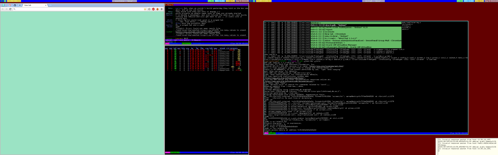

# cwm-new

[](https://travis-ci.org/ThomasAdam/cwm)

This is a working title for what will become a new window manager.  Ideas
for a name are welcome.

This is based from
[CWM](http://cvsweb.openbsd.org/cgi-bin/cvsweb/xenocara/app/cwm/) in
OpenBSD.

# Requirements

* pkg-config
* Xft
* RandR

# Features

Current features which differ from cwm are:

* RandR is used for monitor detection, not Xinerama;
* group0 is no longer special, it's just another group;
  * Toggling all groups is available as a command.
  * Groups are per RandR output, and are separate for each output;
  * Status output sent to a named FIFO (/tmp/cwm-$PID_OF_CWM.fifo):
    * Can be parsed and used with dzen2/lemonbar, for instance, check the
	  [read_status.pl](examples/read_status.pl) file for an example of this.

# Screenshot

Obligatory screenshot below!  The bar at the top is lemonbar, with conky
output on the right.



# Tasks

See the [TODO](TODO.md) file.

# New Config Format

See the [CONFIG](CONFIG.md) file for ideas for a new config file structure.

# Contact

You can reach me via the following:

* Email:  thomas.adam22@gmail.com
* IRC:	  ```thomas_adam``` on ```freenode.net```
